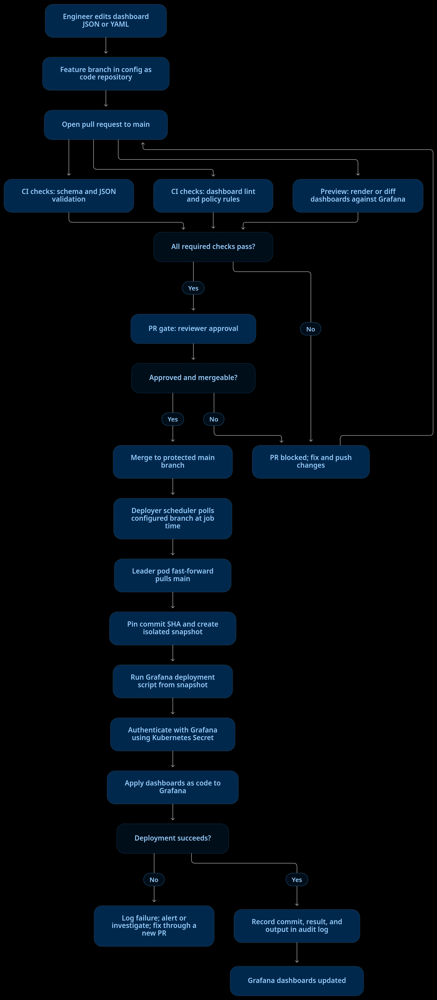

# Grafana dashboards as code: deployer flow

## Example setup

- **Config as code repository:** holds dashboard definitions and `scripts/deploy-grafana-dashboards.sh`.
- **PR checks:** validate dashboard JSON, enforce naming or folder rules, and optionally show a Grafana diff or preview. Require these checks and reviewer approval before merging.
- **Deployer job:** configure `git.repository`, `git.branch: main`, a cron schedule, and `script: scripts/deploy-grafana-dashboards.sh` in the deployer Helm values. The script path is relative to the repository root.
- **Runtime:** the elected leader pulls the configured branch before each scheduled run and executes an isolated snapshot tied to that commit. A failed pull skips the run; it does not deploy an older revision.
- **Credentials and traceability:** store the Grafana service account token in a Kubernetes Secret and expose it to the script securely. With audit enabled, PostgreSQL records the commit metadata, job, outcome, and captured output.

The CI checks and PR approval are supplied by the Git hosting/CI platform. The deployer runs the scheduled script after merge; it does not itself open PRs or evaluate PR gates.
